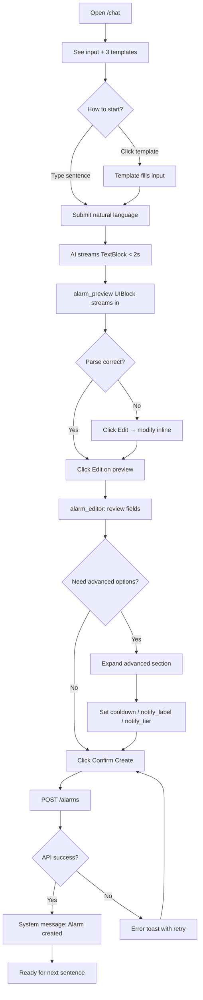
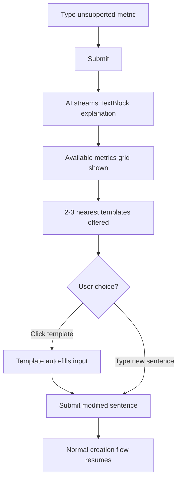
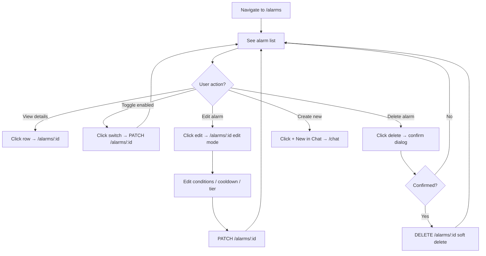

# UX Design Specification market

**Author:** Stepheno
**Date:** 2026-05-04

---

## Executive Summary

### Project Vision

Market is an AI-driven stock alert platform whose sole killer feature is **natural language alarm creation**: the user describes a trading scenario in one sentence, the AI parses it into a structured condition card within 2 seconds, and the user confirms — the entire flow completing in under 1 minute. The design system (DESIGN.md) establishes "The Calm Workshop" as the creative north star: an Apple-inspired precision tool with a single Action Blue accent, SF Pro tight-tracked typography, parchment warmth, and zero-shadow flatness. This philosophy explicitly rejects the information overload of traditional broker apps (dense grids, flashing tickers) and the social noise of community platforms. Every surface decision answers one question: does this help the user act on a signal?

### Target Users

- **Primary — Active A-share short-term traders:** Users who monitor specific high-stakes scenarios like 翘板 (capital lifting a limit-down stock) and 涨停砸盘 (large sells hitting a limit-up position). Their core pain point is that broker-app alerts are either too coarse (price-only) or too complex to configure quickly. Time is their adversary — a one-second delay can miss the optimal entry window.
- **Secondary — Invited beta users:** Moderate stock-trading experience, familiar only with basic broker-app features. They need zero-learning-curve onboarding: see a template, type a sentence, get an alert. The aha moment is "I didn't have to fill in any parameters."
- **V1 scale:** Founder + fewer than 10 invited beta users. Desktop-primary during trading hours (9:30–15:00 CST).

### Key Design Challenges

1. **Zero-learning-cost trust in natural language input.** Users must feel confident typing a sentence into the chat input on their very first visit — not hunting for a form. The input field's visual weight, placeholder examples, and template card onboarding must work together to communicate "just say it." This challenges the DESIGN.md principle of visual restraint: the input must be prominent without breaking the calm.
2. **Rapid validation of AI-parsed results.** The structured confirmation card (alarm_editor UIBlock) must let users verify correctness within 5 seconds. Condition display needs to be immediately scannable — stock name, condition logic (AND/OR), individual conditions, cooldown, notification tier — all at a glance. The editing path must be intuitive enough that corrections feel like tweaking, not re-learning.
3. **Alarm list information density vs. calm aesthetic.** DESIGN.md demands that "nothing shouts for attention," yet the alarm list must simultaneously show symbol, condition summary, enabled status, notify tier, and last triggered time. The challenge is achieving scannability without introducing the visual noise Market explicitly rejects in broker apps.

### Design Opportunities

1. **The input box IS the product value.** If the chat input experience is sufficiently fluid — with placeholder text cycling through real trading scenarios, instant AI parsing feedback, and template cards that demonstrate the one-sentence promise — the input itself becomes the strongest retention driver. The aha moment lives in the composer.
2. **Apple-style financial tool as brand differentiation.** In a market where every broker app piles on information density, a "calm workshop" aesthetic — parchment warmth, single-accent discipline, editorial typography at 17px — is itself a competitive advantage. The visual restraint communicates product confidence: "we only show you what matters."
3. **Push notification as the highest-frequency product touchpoint.** Alarm-triggered notifications are the moment of truth — they must deliver within 2 seconds of the market event. The notification's content template (PRD 6.1), custom notify_label, and in-app feedback mechanism (👍👎) form a feedback loop that drives perceived value and retention.

## Core User Experience

### Defining Experience

The defining interaction is **typing one sentence into the chat input**. This single action is the product's entire value proposition compressed into one moment: the user describes a trading scenario in natural language, and within 2 seconds the AI begins streaming a structured interpretation back. The entire creation loop — from first keystroke to persisted alarm — completes in under 1 minute. If this input-to-confirmation flow feels effortless, everything else follows.

The experience has two parallel paths of equal design importance:

- **Success path:** User types → AI parses → structured confirmation card appears → user scans, tweaks, confirms → alarm created. Three user actions total: type, verify, confirm.
- **Graceful degradation path:** User types an unsupported metric or scenario → AI responds with a clear natural-language explanation → system shows available metrics with scenario-based examples → 2-3 nearest-match templates offered as one-tap shortcuts. The "unsupported → educate → guide" loop must feel as fluid as the success path. FR11 mandates that the AI never produces an incorrect or incomplete draft — it explains the limitation and redirects.

### Platform Strategy

- **Primary platform:** Desktop web browser (Chrome, Safari, Firefox latest stable). Trading hours (9:30–15:00 CST) are the peak usage context. Keyboard-driven input, mouse for card editing and list management.
- **Secondary platform:** Mobile browser — SPA remains usable but not pixel-optimized. Native mobile app deferred to Phase 2 (market-native).
- **Real-time channels:** SSE (`text/event-stream`) for chat streaming within the app; Web Push API (Service Worker + FCM/APNs) for alarm notifications when the tab is backgrounded or closed. These channels are architecturally independent.
- **Offline:** Not required. The product is meaningless without real-time market data.
- **Behind-login SPA:** No SEO, no SSR. Authenticated sessions only via Better-Auth + Google OAuth.

### Effortless Interactions

1. **Input-as-understanding.** After the user finishes typing and submits, the AI-parsed result begins streaming within 2 seconds. No additional clicks, no form navigation. The response appears in the conversation thread as naturally as a chat reply.
2. **Confirm-to-create.** The structured confirmation card (alarm_editor UIBlock) presents all editable fields — symbol, condition group with AND/OR toggle, cooldown, notify_label, notify_tier — in a single card. The user scans, makes any corrections inline, and taps the confirm button. No page transitions, no multi-step wizard.
3. **Push-as-feedback.** When an alarm fires, the notification arrives within 2 seconds. Content follows the PRD 6.1 template (stock name + change | trigger condition | context). The 👍👎 feedback action is embedded in the notification itself — no need to open the app to rate.
4. **Educate-don't-block.** When the user describes an unsupported metric (e.g., "alert me on MACD golden cross"), the system streams a natural-language explanation, displays the list of supported metrics (price, pct_change, volume, turnover, limit_up, limit_down, volume_ratio_5m, price_change_5m) with concrete scenario examples, and offers 2-3 nearest-match preset templates as one-tap alternatives. The user should feel guided, not rejected.

### Critical Success Moments

1. **The first 2 seconds after submission.** When the AI returns the first streamed token of its parsed result, the user judges the product. Accurate parsing + clear structured display = "this is a hundred times simpler than my broker app." This is the aha moment defined in the PRD.
2. **The first push notification.** Alarm fires, notification arrives within 2 seconds, content is immediately comprehensible. This is when the product transforms from "tool" to "trading edge." A late or ambiguous notification destroys trust instantly.
3. **Alarm count going from 0 to 2.** When the user creates a second alarm in their first session, it signals that the first experience was smooth enough to invest again. PRD target: ≥ 2 alarms in first session.

### Experience Principles

1. **One-Sentence Rule.** Every alarm creation starts with one sentence — never a form, never parameters, never dropdowns. The chat input carries the highest visual weight on the page.
2. **Signal Over Noise.** Every surface shows only what the user needs at that moment. No flashing tickers, no social feeds, no decorative elements. Following DESIGN.md's "calm workshop" philosophy: if a user sees an element, it must be worth seeing.
3. **2-Second Immediacy.** AI parsing, push notifications, page loads — every critical path delivers user-facing feedback within 2 seconds. Waiting is the enemy of trust.
4. **Confirm, Don't Guess.** AI output is always a draft. The user's explicit confirmation is the sole authority for alarm creation. The confirmation card is a safety net, not an obstacle — it makes the user feel in control.
5. **Educate, Don't Block.** When user intent exceeds system capability, the response is always: (1) explain what'sunsupported, (2) show what's available, (3) offer the closest one-tap alternative. Unsupported metrics are guidance opportunities, not error states.

## Desired Emotional Response

### Primary Emotional Goals

The dominant emotion Market should evoke is **a sense of control**. Not excitement, not urgency, not FOMO — but the quiet confidence that "I received the right signal at the right time, and I have enough time to act." This stands in direct opposition to the anxiety that traditional broker apps manufacture through flashing tickers, red-green color shifts, and information overload. Market's "calm workshop" aesthetic is not an absence of emotion — it is a deliberate emotional posture: precision over stimulation.

### Emotional Journey Mapping

| Stage                            | User Feeling                                                              | Design Support                                                               |
| -------------------------------- | ------------------------------------------------------------------------- | ---------------------------------------------------------------------------- |
| **First open /chat**             | Curiosity + mild uncertainty ("Can one sentence really create an alert?") | Clean input field + 3 template cards as anchors, lowering the cost of trying |
| **After submitting a sentence**  | Anticipation → Surprise ("It actually understood")                        | AI-parsed result streams back within 2 seconds; speed itself builds trust    |
| **Seeing the confirmation card** | Confirmation + Control ("I can read this, I can change it")               | Clear field labels, intuitive editing, no hidden logic                       |
| **Alarm created**                | Accomplishment ("Done in under a minute")                                 | Brief success feedback + new alarm appears in list                           |
| **Push notification arrives**    | Urgency tempered by calm ("Signal received — I have time")                | Structured notification content + notify_label for instant recognition       |
| **Unsupported metric response**  | Guided, not rejected ("So that's what else I can do")                     | Available metrics list + scenario examples + nearest-match templates         |
| **Daily return**                 | Reassurance + Trust ("It's watching for me")                              | Alarm list at a glance, clear status indicators                              |

### Micro-Emotions

1. **Confidence vs. Confusion** — The most critical pair. The structured confirmation card must let the user verify correctness in under 5 seconds. Every field (stock name, condition, operator, threshold) must use trader-familiar language, not technical jargon. Any ambiguity slides the user toward confusion.
2. **Trust vs. Skepticism** — Push notification timeliness is the foundation of trust. The 2-second delivery commitment is a technical metric, but the emotional dimension is "I can rely on this tool." Notification content must be precise enough to convey trigger context ("Cuiwei Shares · Limit-down opened + Volume surge"), not vague ("Your alert was triggered").
3. **Calm vs. Anxiety** — The core emotional differentiator from DESIGN.md. Traditional broker apps use red-green flashing to manufacture urgency and anxiety. Market's parchment warmth + single Action Blue accent communicates "you don't need to panic; the signal arrives, you have time." The 17px body text "thinking pace" is an emotional design choice, not just a typographic one.

### Design Implications

- **Calm is a feature, not an absence.** No flashing, no information stacking, no FOMO triggers. Every pixel helps the user make a calm decision rather than stimulating action.
- **Speed builds trust.** 2-second AI parsing, 2-second push delivery — immediacy is an emotional commitment, not just a performance target. "It always tells me first."
- **Transparency eliminates skepticism.** AI parsing is visible (streaming display), results are editable (confirmation card), unsupported requests are honestly explained (education over guessing). No black box.
- **Confirmation creates control.** The user never passively receives AI output. Every alarm passes through explicit user confirmation. Confirmation is not friction — it is the feeling of safety.

### Emotional Design Principles

1. **Calm is a feature.** No flashing, no stacking, no FOMO. Every pixel serves calm decision-making, not stimulation.
2. **Speed builds trust.** Immediacy is an emotional commitment — "it always tells me in time."
3. **Transparency eliminates doubt.** Visible parsing, editable results, honest limitations. No black box.
4. **Confirmation is safety.** The user never passively accepts AI output. Every alarm is explicitly confirmed. Control is the feeling, not a workflow step.

## UX Pattern Analysis & Inspiration

### Inspiring Products Analysis

**Apple.com — Narrative Rhythm & Visual Discipline**

DESIGN.md explicitly establishes Apple as the visual benchmark. Beyond typography and color, the deeper UX lesson is Apple's narrative structure: one page tells one story, each section carries one information tier, and attention is guided naturally through scroll. Market's chat page should adopt this "one screen, one focus" rhythm — when typing, only the input exists; when confirming, only the card exists.

Key patterns: section alternation (parchment / near-black tiles), single CTA visual weight per view, progressive disclosure of detail.

**ChatGPT / Claude — Chat-Native AI Interaction Paradigm**

Market uses `assistant-ui`, making it fundamentally a chat-based AI product. The proven patterns: input box as the landing state (no empty-state dashboard), streaming responses to reduce perceived latency, and structured content blocks (code blocks, tables) embedded within the conversation flow without breaking its continuity. Market's `alarm_editor` UIBlock is a direct application of this pattern — a structured form living inside the chat thread.

**Linear — Restrained Information Density**

Linear sets the standard for balancing information density with visual restraint in productivity tools. Its issue/notification lists demonstrate compact rows with status indicated through subtle background tints rather than icon overload. For a desktop-primary tool, Linear's keyboard-driven efficiency is a relevant reference. The side-panel detail pattern (list on left, detail on right) is worth considering for Phase 2.

### Transferable UX Patterns

| Pattern                          | Source           | Market Application                                                                                    |
| -------------------------------- | ---------------- | ----------------------------------------------------------------------------------------------------- |
| Input box as landing state       | ChatGPT          | `/chat` opens directly to input + template cards; no empty state                                      |
| In-message structured components | ChatGPT / Claude | `alarm_editor` UIBlock embedded in conversation flow; no page navigation                              |
| Single CTA visual weight         | Apple            | One pill button per view in Action Blue; no competing CTAs                                            |
| Compact list rows + status tints | Linear           | Alarm list rows are compact; status (active/triggered/paused) via background tint, not border stripes |
| Progressive disclosure           | Apple            | Advanced options (cooldown, notify_label, notify_tier) collapsed by default in confirmation card      |
| Keyboard efficiency              | Linear           | Enter to send, Tab to cycle condition fields, keyboard shortcuts for enable/disable alarm             |

### Anti-Patterns to Avoid

1. **Broker-app information overload** — Tonghuashun and East Money stack market data, news, and recommendations on every surface. Market's `/chat` page shows zero market data — focus stays on input.
2. **Social feed contamination** — Xueqiu and Futu embed community discussions and leaderboards. Market displays zero social content.
3. **Red-green flashing states** — Traditional market apps use color flashing to manufacture urgency. Market uses subtle background tint changes for status — no flashing.
4. **Multi-step form wizards** — Traditional alert creation requires navigating three menu layers and filling multiple parameter forms. Market replaces this with one sentence + one confirmation card.
5. **Notification/alarm list conflation** — Notifications (delivery records) and alarms (persistent rules) are separate domain concepts and must not be merged into a single list view.

### Design Inspiration Strategy

**Adopt directly:**

- Apple's visual discipline (single accent, zero shadows, parchment rhythm) — already codified in DESIGN.md
- ChatGPT's input-first paradigm — `/chat` page core interaction
- Linear's compact list + status tint pattern — alarm list design

**Adapt for Market:**

- ChatGPT streaming → adapt to SSE + UIBlock structured streaming (structured card updates, not just text deltas)
- Apple progressive disclosure → adapt to confirmation card with collapsible advanced options (notify_label, notify_tier hidden by default)
- Linear side-panel detail → adapt to dedicated `/alarms/:id` route for V1 (side-panel pattern deferred to Phase 2)

**Explicitly reject:**

- All broker-app information density patterns
- All social platform feed and comment components
- All form-driven alert creation workflows

## Design System Foundation

### Design System Choice

**Themeable system: shadcn/ui + TailwindCSS, customized with DESIGN.md tokens.**

The design system decision is already established in the project's technical foundation:

- **shadcn/ui** — Component primitives (headless components with full source-code ownership, built on Radix UI for accessibility). Not a traditional npm-package component library — components are copied into the project and fully owned.
- **TailwindCSS** — Utility-first CSS framework, configured with design tokens derived from DESIGN.md's visual specification.
- **assistant-ui** — Third-party library for chat container, message timeline, composer, and streaming-friendly message rendering. Provides the chat infrastructure; Market customizes its visual appearance.
- **React + TypeScript** — Frontend framework.

### Rationale for Selection

1. **Visual uniqueness requirement.** DESIGN.md defines "The Calm Workshop" as a highly specific visual identity — single Action Blue accent, SF Pro tight-tracked typography, parchment warmth, zero shadows, pill-radius CTAs. This level of specificity cannot be achieved with an off-the-shelf system like Material Design or Ant Design without extensive overrides that would negate the convenience of using them.
2. **Source-code ownership.** shadcn's copy-paste model means every component's implementation lives in the project. This is critical for Market's custom UIBlock components (alarm_editor, alarm_preview) which must integrate seamlessly with the design system's visual language.
3. **Team scale.** Solo founder + AI-assisted development. shadcn eliminates the overhead of building primitives from scratch while preserving full control — the right balance for a small team that needs both speed and precision.
4. **DESIGN.md as the single source of truth.** The design system document already provides a complete token set (13 colors, 12 typography scales, 4 radius levels, 8 spacing levels, 11 component specifications). This eliminates the "blank canvas" problem — tokens are defined, not discovered.

### Implementation Approach

1. **Design tokens → TailwindCSS configuration.** Map all DESIGN.md tokens into `tailwind.config.ts` under `theme.extend`: colors (primary, ink variants, canvas variants, surface variants), typography (font families, sizes, weights, letter-spacing), border-radius (xs through pill), spacing (xxs through section).
2. **shadcn component overrides.** Apply DESIGN.md component specifications to shadcn primitives: Button variants (primary pill, secondary ghost, dark utility, pearl capsule), Card (utility-card with canvas background + lg radius), Input (search-input with pill radius + 44px height).
3. **Custom Market components.** Build from shadcn primitives — no equivalent exists in shadcn:
   - `alarm_editor` UIBlock — structured confirmation card with condition rows, AND/OR toggle, cooldown picker, notify_label input, notify_tier selector, confirm CTA
   - `alarm_preview` UIBlock — read-only parsed result display
   - Alarm list row — compact row with symbol, condition summary, status tint, tier badge, action buttons
4. **assistant-ui theme integration.** Override assistant-ui's default chrome to match "calm workshop" aesthetics: parchment background for chat thread, SF Pro typography, minimal composer styling, Action Blue for send button.

### Customization Strategy

**Token-driven consistency.** Every visual decision flows from DESIGN.md tokens through TailwindCSS config. Components never hardcode colors, sizes, or radii — they reference semantic tokens (`bg-canvas`, `text-ink`, `rounded-pill`, `font-body`). This ensures that any DESIGN.md revision propagates automatically.

**Component hierarchy:**

| Layer             | Source                         | Examples                                    |
| ----------------- | ------------------------------ | ------------------------------------------- |
| Tokens            | DESIGN.md → TailwindCSS config | colors, typography, spacing, radius         |
| Primitives        | shadcn/ui (owned source)       | Button, Card, Input, Select, Toggle, Dialog |
| Market components | Custom from primitives         | alarm_editor, alarm_preview, alarm-list-row |
| Page layouts      | Route-level composition        | /chat, /alarms, /alarms/:id                 |

**Constraint enforcement.** DESIGN.md's rules are encoded as Tailwind constraints: no weight 500 (enforced via token omission), no shadows except product-imagery (enforced via `shadow` token set), pill radius only for primary actions (enforced via component variant mapping).

## Core User Experience — Defining Interaction

### Defining Experience

**"Say one sentence, alarm created in 60 seconds."**

When users describe Market to friends, they will say: "You just type one sentence, like 'alert me when Moutai hits 1800,' and it sets up the alert automatically." This is Market's swipe-left-swipe-right-level core action. The entire product value proposition is compressed into this single moment: natural language input → AI parsing → structured confirmation → persisted alarm, all within 60 seconds.

### User Mental Model

| Current Solution                                       | User Mental Model                                                  |
| ------------------------------------------------------ | ------------------------------------------------------------------ |
| Broker app: navigate three menu layers to set alert    | "Setting alerts is annoying, I usually don't bother"               |
| Manual monitoring: watching limit-down board for opens | "Staring at the screen is exhausting, but I'll miss it if I don't" |
| WeChat group: waiting for someone to call out signals  | "Signal arrives but I don't know if it's reliable"                 |
| Expectation when encountering "smart alert" product    | "Probably another complex form, right?"                            |

Market must break the last expectation within the first 5 seconds of opening `/chat`. The user sees not a form, but an input field + 3 template cards. This mental-model shift is accomplished by visual first impression alone — no onboarding text or tutorial required.

### Success Criteria

1. **"That's it?"** — After clicking "Confirm Create," the user should never feel "are there more steps?" One button, creation complete.
2. **First-attempt parse accuracy ≥ 85%.** AI accurately matches user intent on the first try. If inaccurate, the user can correct within 3 clicks (change value, toggle AND/OR, swap stock).
3. **Perceived speed < 5 seconds.** From submit to seeing the complete structured card. Streaming rendering makes it feel "almost instant." NFR3: first token < 2 seconds.
4. **Zero-documentation onboarding.** New users need no instructions, tutorials, or help pages. Placeholder text + template cards = the entire onboarding.

### Novel UX Patterns

| Interaction Element               | Pattern Source                  | Market's Uniqueness                                                         |
| --------------------------------- | ------------------------------- | --------------------------------------------------------------------------- |
| Chat input box                    | ChatGPT (established)           | User types trading intent, not questions                                    |
| Streaming AI response             | ChatGPT (established)           | Response is a structured editable form, not text                            |
| Structured confirmation card      | Traditional forms (established) | Embedded in conversation flow; no page navigation                           |
| One-sentence → structured parsing | **Innovative combination**      | NL parsing + structured confirmation + instant creation in a seamless chain |

The innovation is not in any single component but in the **combination**: a chat paradigm where the AI response is not text but an actionable, editable structured form — and confirming that form is the entire creation workflow. No other financial alert product currently offers this combination.

### Experience Mechanics

**1. Initiation**

- User opens `/chat` → sees the input field (highest visual weight on the page) + 3 template cards below
- Input placeholder cycles through real trading scenarios: "翠微股份跌停打开的时候提醒我，放量3倍以上"
- Template cards: Price Breakout / Volume Surge / Large Move — click to fill input
- User presses Enter or clicks send button to submit

**2. Interaction**

- After submit, < 2 seconds, AI begins streaming content
- TextBlock appears first (text explanation: "I'll set up a Cuiwei Shares alert with these conditions:")
- alarm_preview UIBlock streams in next (read-only preview of parsed structured conditions)
- User clicks "Edit" on the preview card → card transitions in-place to alarm_editor (editable state)
- Editor contains: condition rows (metric + operator + value), AND/OR toggle, cooldown input, notify_label text field (optional), notify_tier selector (standard/emphasis)

**3. Feedback**

- Every field modification reflects immediately; no save button
- Card height adapts dynamically as condition rows are added/removed; no page jump
- Real-time input validation: empty values, negative numbers, invalid stock codes → inline error text in ink-muted-48 color
- Unsupported metric response: TextBlock explanation → available metrics list with scenario demos → nearest-match templates as one-tap alternatives

**4. Completion**

- User clicks pill-shaped "Confirm Create" button (Action Blue, the sole CTA on the page)
- Button state: loading (transform: scale(0.95) press state) → success
- On success: (1) system message appended to chat: "Alarm created: {Stock Name} · {Condition Summary}"; (2) brief toast confirmation appears top-right; (3) sidebar alarm count increments
- User can immediately type the next sentence to create a second alarm

## Visual Design Foundation

### Color System

DESIGN.md provides a complete color token set. The UX specification adds **semantic mapping** — how each token applies to specific interface scenarios — and defines alarm status colors (not specified in DESIGN.md).

**Primary Token Usage:**

| Semantic Use                      | Token                   | Description                                   |
| --------------------------------- | ----------------------- | --------------------------------------------- |
| Primary CTA, interactive elements | `#0066cc` Action Blue   | The sole interactive color. Blue = actionable |
| Keyboard focus outline            | `#0071e3` Focus Blue    | 2px solid outline on focus                    |
| Links on dark surfaces            | `#2997ff` Sky Link Blue | Dark-tile-only variant                        |
| Page background                   | `#f5f5f7` Parchment     | Default canvas                                |
| Card / content area background    | `#ffffff` Canvas        | Maximum contrast areas                        |
| Headlines, body text              | `#1d1d1f` Ink           | All primary text                              |
| Secondary text                    | `#333333` Ink Muted 80  | When Ink is too heavy                         |
| Disabled states, fine print       | `#7a7a7a` Ink Muted 48  | Lightest text tone                            |
| Soft section dividers             | `#f0f0f0` Divider Soft  | Between cards                                 |
| Utility borders                   | `#e0e0e0` Hairline      | 1px structural borders                        |

**Alarm Status Colors (UX extension):**

DESIGN.md prohibits colored border-left stripes. Alarm cards use background tints for status indication.

| Alarm Status      | Background Tint                                                 | Description                          |
| ----------------- | --------------------------------------------------------------- | ------------------------------------ |
| Active (running)  | Canvas `#ffffff` + subtle green tint `rgba(52, 199, 89, 0.06)`  | Nearly imperceptible green undertone |
| Triggered (fired) | Canvas `#ffffff` + subtle amber tint `rgba(255, 159, 10, 0.08)` | Warm indication, not urgent          |
| Paused (disabled) | `#fafafc` Surface Pearl + text muted to Ink Muted 48            | Overall desaturation                 |

### Typography System

DESIGN.md's typography is complete. The UX specification maps tokens to **interface scenarios**.

| Scenario                                   | Token                                   | Rationale                                              |
| ------------------------------------------ | --------------------------------------- | ------------------------------------------------------ |
| Alarm creation success system message      | `{typography.body}`                     | Matches regular conversation text, no special emphasis |
| Confirmation card title (stock name)       | `{typography.body-strong}`              | 17px/600 — one field is enough                         |
| Condition row values                       | `{typography.body}`                     | Default reading pace                                   |
| Condition row labels ("Price", "Change %") | `{typography.caption}`                  | 14px secondary labels                                  |
| Template card titles                       | `{typography.body-strong}`              | Consistent with confirmation card                      |
| Input placeholder                          | `{typography.body}` color: Ink Muted 48 | Reduced visual weight, readable                        |
| Alarm list condition summary               | `{typography.caption}`                  | Compact display                                        |
| Global navigation                          | `{typography.fine-print}` 12px          | Per DESIGN.md specification                            |

### Spacing & Layout Foundation

| Layout Area                     | Spacing              | Rationale                         |
| ------------------------------- | -------------------- | --------------------------------- |
| Page horizontal margin          | `{spacing.xl}` 32px  | Content breathes, no edge-hugging |
| Chat message gap                | `{spacing.md}` 17px  | Rhythmic but not loose            |
| Confirmation card padding       | `{spacing.lg}` 24px  | DESIGN.md utility-card spec       |
| Condition row gap               | `{spacing.sm}` 12px  | Compact but scannable             |
| Template card gap               | `{spacing.md}` 17px  | Clickable area preserved          |
| Alarm list row gap              | `{spacing.xs}` 8px   | Linear-style density              |
| Section gap (chat ↔ alarm list) | `{spacing.xxl}` 48px | Clear functional separation       |

**Layout approach:** Single-column flow layouts. No traditional grid system. `/chat` max-width ~768px centered (Apple-style content width). `/alarms` list max-width ~960px. Content width determines layout, not column count.

### Accessibility Considerations

- V1 does not prioritize accessibility (per PRD explicit statement).
- Baseline requirements met: Action Blue `#0066cc` on Parchment `#f5f5f7` contrast ratio 4.5:1 (WCAG AA). Ink `#1d1d1f` on Parchment contrast ratio > 10:1.
- Keyboard navigation: Tab order follows natural reading flow. Focus Blue outline at 2px provides clear focus indication.
- Full WCAG compliance and screen reader support deferred to post-beta.

## Design Direction Decision

### Design Directions Explored

Market's visual direction is locked by DESIGN.md ("The Calm Workshop"). Rather than exploring competing visual directions, the HTML showcase at `_bmad-output/planning-artifacts/ux-design-directions.html` validates the DESIGN.md token system applied to Market's six key interface scenarios:

1. `/chat` page — input-first landing, template cards, user message, AI text response, alarm_preview UIBlock
2. Alarm Editor UIBlock — editable confirmation card with AND/OR toggle, condition rows, collapsible advanced options
3. Success state — inline creation feedback, conversation continuation
4. Graceful degradation — unsupported metric response with education grid and one-tap alternative templates
5. `/alarms` list — compact rows with status tints (active/triggered/paused), tier badges, toggle controls
6. Design token reference — all colors, spacing, and radius tokens visualized

### Chosen Direction

**"The Calm Workshop" — Apple-inspired precision tool with strict single-accent discipline.**

No alternative visual directions were explored. The design direction is DESIGN.md, which was established before the UX specification process. The showcase validates feasibility, not direction.

### Design Rationale

Key validation findings from the HTML showcase:

- **Single accent (Action Blue) is sufficient for all interaction semantics** in a financial alert context — CTAs, links, focus states, selected states, and tier badges are all carried by one blue. No second accent color is needed.
- **Parchment + Canvas alternation provides adequate visual rhythm** — chat background (parchment) vs. card surfaces (canvas) creates natural separation without shadows or heavy borders.
- **Zero-shadow strategy holds for alarm cards** — background tints and 1px hairline borders provide sufficient boundary definition, consistent with DESIGN.md's "one shadow for product imagery only" rule.
- **Status indication via background tints works** — active (subtle green undertone), triggered (warm amber undertone), paused (surface pearl + muted text) all respect the "no border-left color stripes" prohibition while remaining scannable.

### Implementation Approach

The HTML showcase serves as a **visual specification reference** for frontend implementation. Component-by-component mapping:

| Showcase Component        | Implementation Target   | shadcn Base                           |
| ------------------------- | ----------------------- | ------------------------------------- |
| Composer input            | `search-input` token    | shadcn Input + custom pill radius     |
| Template cards            | `utility-card` variant  | shadcn Card                           |
| alarm_preview UIBlock     | Custom Market component | shadcn Card (read-only)               |
| alarm_editor UIBlock      | Custom Market component | shadcn Card + Select + Input + Button |
| Alarm list row            | Custom Market component | shadcn Card (compact variant)         |
| Status toggle             | Toggle control          | shadcn Switch                         |
| Tier badge                | Inline label            | Custom styled span                    |
| Unsupported response grid | Custom Market component | shadcn Card grid                      |

## User Journey Flows

### Journey 1: Alarm Creation (Success Path)

**Key metrics:** Complete in < 60 seconds. 3 user actions: type → verify → confirm.

### Journey 2: Alarm Creation (Graceful Degradation — Unsupported Metric)

**Design principle:** The degradation path stays within the same conversation flow. The user never leaves the input context — they type, get educated, and continue typing.

### Journey 3: Alarm Management (/alarms Page)

### Journey Patterns

| Pattern                      | Applied To             | Implementation                                                             |
| ---------------------------- | ---------------------- | -------------------------------------------------------------------------- |
| **In-conversation action**   | Creation, degradation  | All operations complete within /chat conversation flow; no page navigation |
| **Confirm-to-execute**       | Create, edit, delete   | User confirms → API call → inline feedback; no intermediate pages          |
| **In-place editing**         | Condition modification | Click Edit → card transitions to editable state in-place; no navigation    |
| **Instant state reflection** | Toggle, delete         | List updates immediately after action; no page refresh                     |
| **Inline error recovery**    | API failure            | Toast shows error + retry button; user input is preserved                  |

### Flow Optimization Principles

1. **Minimum steps to value.** Alarm creation: 3 steps (type → verify → confirm). Alarm management: 1 step (toggle/delete).
2. **No dead ends.** Every error state has a recovery path — retry button on API failure, alternative templates on unsupported metrics, undo on accidental delete.
3. **Zero context switching.** Creation flow stays entirely in /chat. Management flow stays entirely in /alarms. No cross-page navigation mid-task.
4. **Immediate feedback loops.** Every action produces visual feedback within 2 seconds — streaming render for creation, toast for success/error, list refresh for management actions.

## Component Strategy

### Design System Components

Components available from shadcn/ui + DESIGN.md token overrides:

| Component           | Source             | Market Usage                                                     |
| ------------------- | ------------------ | ---------------------------------------------------------------- |
| Button (4 variants) | shadcn + DESIGN.md | primary pill (CTA), secondary ghost, dark utility, pearl capsule |
| Card                | shadcn + DESIGN.md | utility-card: canvas bg + lg radius + hairline border            |
| Input               | shadcn + DESIGN.md | search-input: pill radius + 44px height                          |
| Select              | shadcn             | Metric and operator dropdowns in condition rows                  |
| Switch              | shadcn             | Alarm enable/disable toggle                                      |
| Dialog              | shadcn             | Delete confirmation dialog                                       |
| Toast               | shadcn             | Success and error notifications                                  |
| Accordion           | shadcn             | Collapsible advanced options in alarm_editor                     |

### Custom Components

Five Market-specific components not covered by shadcn/ui, built from shadcn primitives:

**1. `alarm_preview` UIBlock**

- **Purpose:** Read-only display of AI-parsed result, inviting user to enter edit mode
- **Content:** Stock name + code, condition logic (AND/OR), condition rows (label + operator + value), cooldown, notify tier
- **Actions:** Single "Edit" button; click transitions card in-place to `alarm_editor`
- **States:** streaming (condition rows render progressively), done (full display)
- **Visual:** Canvas background + 1px hairline border + lg radius. Matches utility-card specification.

**2. `alarm_editor` UIBlock**

- **Purpose:** Editable structured confirmation card for alarm creation
- **Content:** Stock name/code, AND/OR toggle, condition rows (metric Select + operator Select + value Input + remove button per row), "+ Add condition" button, collapsible advanced section (cooldown Input + notify_label Input + notify_tier Select), "Confirm Create" pill button
- **Actions:** All fields editable inline. Confirm button triggers `POST /alarms`.
- **States:** editing (default), submitting (button loading state), success (brief display then dismissed), error (inline error + retry)
- **Visual:** Canvas background + 2px Action Blue border (distinguishes from preview's hairline) + lg radius. "Editing" badge in top-right.
- **Validation:** Real-time inline. Empty condition values, negative cooldown, invalid stock code → ink-muted-48 error text below offending field.

**3. `alarm_list_row`**

- **Purpose:** Compact single-row display in alarm list
- **Content:** Stock name (body-strong), condition summary (caption), tier badge, toggle switch, last triggered time (fine-print), action buttons (edit/delete)
- **States:** active (subtle green tint background), triggered (amber tint background), paused (surface-pearl + all text muted to ink-muted-48)
- **Actions:** toggle → PATCH, edit → navigate `/alarms/:id`, delete → Dialog confirm
- **Visual:** Canvas or pearl background + 1px hairline border + lg radius. Compact row height with xs gap between rows.

**4. `unsupported_response` UIBlock**

- **Purpose:** Educational response when user requests an unsupported metric
- **Content:** TextBlock explanation, available metrics grid (2-column, each: metric name + scenario demo), 2-3 nearest-match template cards (clickable)
- **Actions:** Click template card → auto-fills chat input
- **Visual:** Canvas background + 1px hairline border + lg radius. Internal metric items use surface-pearl background.

**5. `template_card`**

- **Purpose:** Cold-start onboarding preset for new users
- **Content:** Icon, template title (body-strong), one-line description (caption)
- **Actions:** Click → fills chat input with template text
- **States:** default, hover (scale 0.98), active (scale 0.95 — DESIGN.md press state)
- **Visual:** Canvas background + 1px hairline border + md radius. Compact card in a 3-column flex row.

### Component Implementation Strategy

All custom components are built from shadcn primitives and styled exclusively through DESIGN.md tokens via TailwindCSS utility classes. No component hardcodes colors, sizes, or radii — all values reference semantic tokens.

### Implementation Roadmap

| Phase                     | Components                                 | Supports                                      |
| ------------------------- | ------------------------------------------ | --------------------------------------------- |
| **Phase 1 — Core**        | template_card, alarm_preview, alarm_editor | `/chat` creation flow — the V1 killer feature |
| **Phase 2 — Management**  | alarm_list_row + Switch, Dialog            | `/alarms` management page                     |
| **Phase 3 — Degradation** | unsupported_response                       | FR11 unsupported metric education path        |

## UX Consistency Patterns

### Button Hierarchy

| Level     | Component            | When to Use                                               | Visual                                           |
| --------- | -------------------- | --------------------------------------------------------- | ------------------------------------------------ |
| Primary   | `btn-primary` pill   | Single primary action per view ("Confirm Create", "Send") | Action Blue bg + white text + pill radius        |
| Secondary | `btn-secondary` pill | Paired with Primary as alternative ("Cancel")             | White bg + Action Blue border/text + pill radius |
| Utility   | `btn-utility` rect   | Tool actions ("Edit", view toggle)                        | Surface-pearl bg + ink-muted-80 text + md radius |
| Inline    | `text-link`          | Inline text links ("View alarm")                          | No bg + Action Blue text                         |

**Rules:**

- Maximum one Primary button per view (DESIGN.md single-CTA principle).
- All buttons use `transform: scale(0.95)` as press state.
- Primary button focus state: 2px solid Focus Blue outline.

### Feedback Patterns

| Scenario          | Pattern                      | Visual                                                                                | Duration                         |
| ----------------- | ---------------------------- | ------------------------------------------------------------------------------------- | -------------------------------- |
| Action success    | Inline system message        | Surface-pearl bg + ✓ icon + body text + Action Blue link                              | Permanent (in conversation flow) |
| Action failure    | Toast                        | Canvas bg + hairline border + error text + retry button                               | Manual dismiss                   |
| Creation success  | Inline message + alarm count | System message in chat flow + sidebar counter +1                                      | Permanent                        |
| Loading           | Skeleton / spinner           | Skeleton pulse in alarm_editor content area                                           | Until data arrives               |
| Streaming         | Progressive render           | TextBlock characters appear incrementally; UIBlock condition rows render sequentially | Until stream ends                |
| SSE disconnection | In-conversation error        | "Connection lost. Reconnecting..." in chat thread                                     | Until reconnected                |

**Rules:**

- No modal/alert dialogs for success or error feedback.
- Success messages embed in conversation flow (do not block user from continuing to type).
- Error messages always include a recovery action (retry, modify, alternative option).
- Toasts only for situations requiring user attention without blocking the flow.

### Form Patterns

The `alarm_editor` UIBlock is the only "form" in Market (embedded in conversation flow).

| Element          | Pattern                | Description                                                                        |
| ---------------- | ---------------------- | ---------------------------------------------------------------------------------- |
| Condition rows   | Instant editing        | Select/Input changes reflect immediately; no save button                           |
| Advanced options | Progressive disclosure | Collapsed by default via `
`. Contains cooldown, notify_label, notify_tier |
| Validation       | Real-time inline       | Error text below field in ink-muted-48; no red color or error icons                |
| Submit           | Single CTA             | "Confirm Create" pill button — the only Primary button on the page                 |

**Rules:**

- No traditional form layout (label + input two-column grid).
- No "Save" button — all modifications reflect immediately.
- Validation uses gentle prompts (muted text), not strong red/icon error states.

### Navigation Patterns

| Element         | Pattern        | Description                                                                    |
| --------------- | -------------- | ------------------------------------------------------------------------------ |
| Global nav      | Sticky top bar | Pure black bg, 44px height, fine-print 12px text, Chat/Alarms/Settings entries |
| Page switching  | SPA route      | Click nav item → React Router transition, no page refresh                      |
| Back navigation | Browser back   | No custom back button; rely on browser native                                  |
| Detail pages    | `/alarms/:id`  | Click list row → detail page; browser back returns to list                     |

**Rules:**

- Global nav shows no badges, counters, or notification icons (maintains "calm").
- Active nav item uses white text; inactive uses muted gray.
- No breadcrumbs (page hierarchy is only 2 levels: list → detail).

### Empty States & Loading

| State               | Display                  | Description                                                   |
| ------------------- | ------------------------ | ------------------------------------------------------------- |
| Chat empty state    | Input + 3 template cards | No "no messages" prompt; the input itself is the content      |
| Alarm list empty    | Brief text + CTA         | "No alarms yet. Create one in chat." + link to /chat          |
| Alarm list loading  | Skeleton rows            | 3-4 skeleton pulse rows, no spinner                           |
| Detail page loading | Skeleton card            | Card outline + content area skeleton                          |
| SSE disconnect      | In-conversation message  | "Connection lost. Reconnecting..." + auto-reconnect within 5s |

## Responsive Design & Accessibility

### Responsive Strategy

**Desktop-first.** V1 targets desktop as the primary usage context (active traders during trading hours). Mobile browser support is secondary — the SPA should remain usable but is not pixel-optimized.

| Breakpoint | Range      | Strategy                                                                                                                                                                                                     |
| ---------- | ---------- | ------------------------------------------------------------------------------------------------------------------------------------------------------------------------------------------------------------ |
| Desktop    | ≥ 1024px   | Full experience. `/chat` max-width 768px centered. `/alarms` max-width 960px centered.                                                                                                                       |
| Tablet     | 768–1023px | Layout unchanged; content area fills width. Template cards collapse from 3-column to 2-column.                                                                                                               |
| Mobile     | < 768px    | Single-column layout. Template cards stack vertically. Global nav collapses to bottom tab bar (Chat/Alarms/Settings). alarm_editor condition rows stack vertically. Alarm list condition summaries truncate. |

**Key adaptation points:**

- `/chat` composer remains sticky-bottom on mobile, consistent with desktop behavior.
- alarm_editor condition rows below 640px: metric/operator/value stack vertically instead of horizontal.
- Template cards below 768px: stack vertically instead of 3-column flex row.
- Alarm list rows below 768px: action buttons compress spacing; swipe-to-action deferred to Phase 2.

### Accessibility Strategy

PRD explicitly states accessibility is not a V1 priority. Baseline requirements are implemented as engineering hygiene, not as a compliance target.

| Aspect              | V1 Requirement                                                                    | Status                                                       |
| ------------------- | --------------------------------------------------------------------------------- | ------------------------------------------------------------ |
| Color contrast      | WCAG AA (4.5:1 for normal text)                                                   | Met: Action Blue on Parchment 4.5:1; Ink on Parchment > 10:1 |
| Keyboard navigation | Tab order follows reading flow + 2px Focus Blue outline                           | Implement                                                    |
| Semantic HTML       | Native elements for interactive roles                                             | shadcn/Radix provides this by default                        |
| ARIA                | Minimal; shadcn/Radix components include ARIA; custom components add `aria-label` | Implement                                                    |
| Touch targets       | ≥ 44×44px for all interactive elements                                            | Met: DESIGN.md input height 44px                             |
| Screen readers      | Not guaranteed in V1                                                              | Deferred to Phase 2                                          |

### Testing Strategy

| Type          | V1 Scope                                                                                            |
| ------------- | --------------------------------------------------------------------------------------------------- |
| Responsive    | Chrome DevTools device simulation. Desktop Chrome, Safari, Firefox real-browser testing.            |
| Accessibility | Lighthouse automated scan. Manual keyboard navigation test.                                         |
| Not in V1     | Screen reader testing, color blindness simulation, real-device mobile testing. Deferred to Phase 2. |

### Implementation Guidelines

- All spacing uses DESIGN.md tokens via TailwindCSS utility classes; no hardcoded pixel values.
- `/chat` and `/alarms` use `max-w-*` + `mx-auto` for centered content; no fixed-width containers.
- Template cards and condition rows use `flex-wrap` for natural adaptation.
- Global nav transitions from top horizontal bar to bottom tab bar at < 768px breakpoint.
- Media queries only (no container queries); sufficient for V1's two-page structure.
